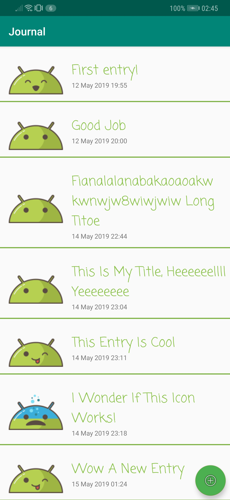
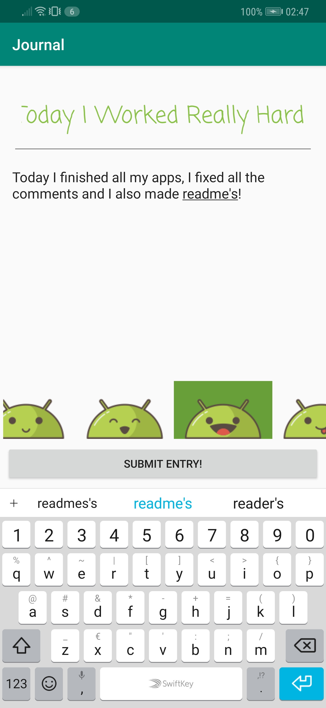

# Journal
A short description of the app Journal.

## Getting Started
### Prerequisites
The app is created in Android-Studio, it is currently made for API 24 Nougat (Android 7.0), but also confirmed running on API 28 Pie (Android 9.0).
An android phone with either one of those Android versions (and most likely the versions in between) will suffice.

## Test
When launching the app, a screen appears showcasing all the entries that are currently saved in the journal app. The entries themselves are clickable. There is also a clickable floating action button in the lower right of the screen, used to submit a new entry.

When clicking on the floating action button, a new screen appears: the submit entry screen. Here the user can enter a title, content and set the mood for the entry they want to make. When clicking on the "SUBMIT ENTRY!" button, the entry will be submitted to the database stored in the app. After submitting, the app will take the user back to the main screen, where the new entry will be visible.

When an entry is clicked, the app will show a new screen that displays the content of the entry.

## Author
* Me

## Acknowledgements
* Renske Talsma
* Natasja Wezel
